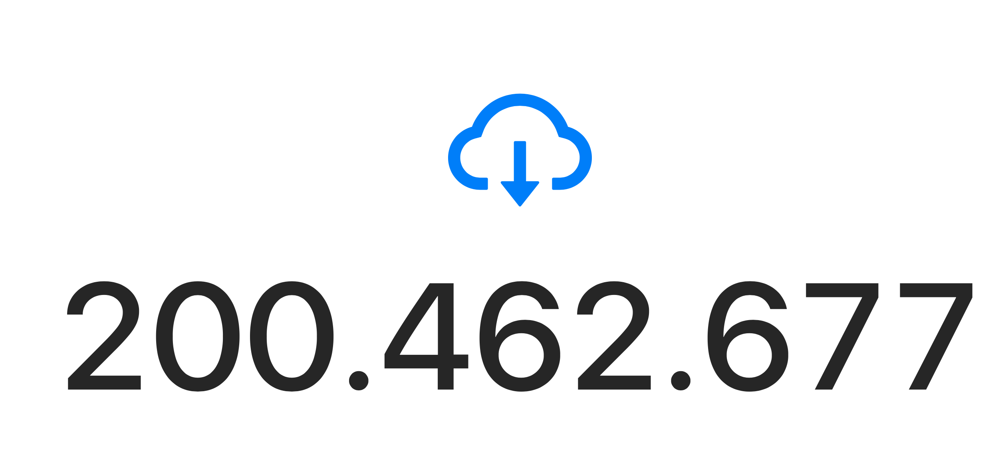
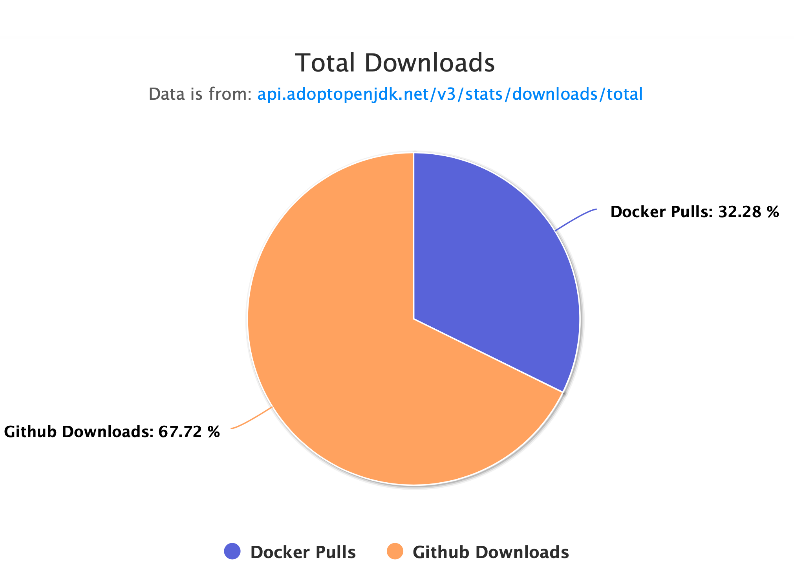
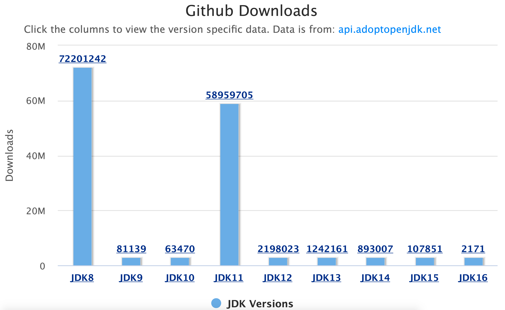
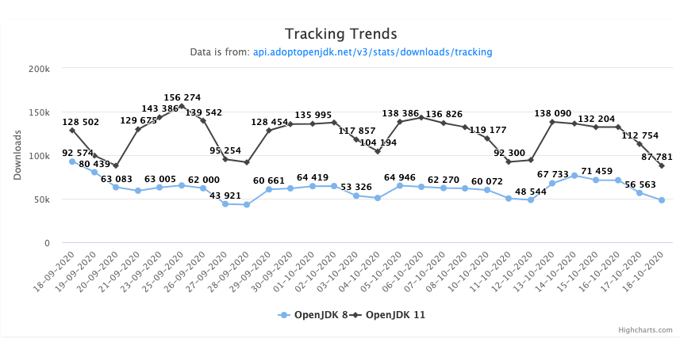

AdoptOpenJDK has once again surpassed all expectations and today reached 200 million downloads! It seems like it was just yesterday that we were celebrating reaching 100 million downloads:

<blockquote class="twitter-tweet">
🎉 100 Million downloads 🎉 That&#39;s right! A massive thank you to everyone who helped us reach this milestone! To say thank you we&#39;ve put together a very exciting giveaway! More details to follow later today. <a href="https://twitter.com/hashtag/millions?src=hash&amp;ref_src=twsrc%5Etfw">#millions</a> <a href="https://twitter.com/hashtag/downloads?src=hash&amp;ref_src=twsrc%5Etfw">#downloads</a> <a href="https://twitter.com/hashtag/openjdk?src=hash&amp;ref_src=twsrc%5Etfw">#openjdk</a> <a href="https://twitter.com/hashtag/java?src=hash&amp;ref_src=twsrc%5Etfw">#java</a> <a href="https://twitter.com/hashtag/giveaway?src=hash&amp;ref_src=twsrc%5Etfw">#giveaway</a> <a href="https://t.co/U7JJ0GiEdp">pic.twitter.com/U7JJ0GiEdp</a>
&mdash; AdoptOpenJDK (@adoptopenjdk) <a href="https://twitter.com/adoptopenjdk/status/1196369855374659587?ref_src=twsrc%5Etfw">November 18, 2019</a></blockquote> 

The project is eternally grateful for the ongoing support from the Java ecosystem and we look forward to seeing the project grow further.

## Download Dashboard

Tracking our downloads has never been easier thanks to our new [Download Dashboard](https://dash-v2.adoptopenjdk.net/). For example we are able to breakdown our downloads by source:

We are also able to breakdown our downloads by major version:

As you can see, OpenJDK 8 is still the most downloaded binary of all time, BUT not for long now because OpenJDK 11 consistently gets more downloads than OpenJDK 8 each day.

