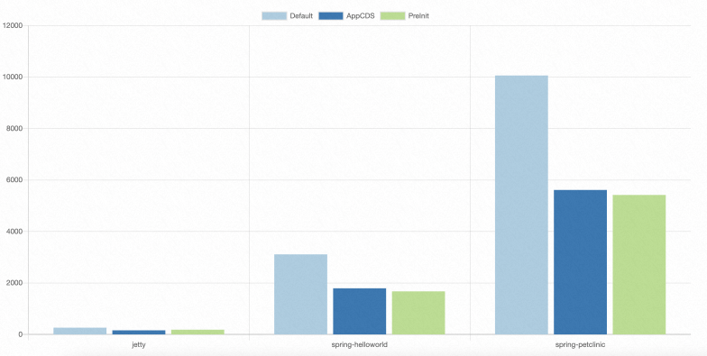

## 1. Background
Java applications are expected to start quickly because of the advent of the cloud-native era. It is becoming increasingly popular to reduce resource costs by dynamically scaling and using serverless computing. Alibaba has done a lot of work and exploration to meet the demands for quick start of applications in Serverless computing scenarios, including AppCDS, Ahead of Time Compilation (AOT), fast class indexing (JarIndex), class pre-initialization, and other technologies to optimize language runtime. Users can obtain up to three times the startup performance improvement without modifying any code. One of the cutting-edge technologies is *class pre-initialization*.

## 2. Class Pre-Initialization
### 2.1 Motivation
Profiling data on Java startup stage shows that the main reason for Javas' slow startup is that it takes much time to load, link, and initialize classes, which we aim to break one by one.

1. Class finding: Fast class indexing can find corresponding Jar file of class in O(1) time
2. Class loading and linkage: The help of AppCDS technology can reduce time consumption and speed up the startup for load and link operations.
3. Class initialization: For the initialization, we observed that if the initialization of classes has no side effects, it is possible to skip the execution of the initialization of these classes. Consider the following code:

```java
public class Foo {
  private static HashMap<Integer, Integer> cache;
  static {
    cache = new HashMap<>();
    for (int i = 0; i < 1024; i++) {
      cache.put(i, 0);
    }
  }
}
```
No matter when, no matter how many times, the result of initialization of the Foo class is the same: creating a hash table with a size of 1024 as a cache will not affect the external environment. In such cases, we can apply class pre-initialization, i.e. dump cache objects into CDS images, and directly map cache objects in CDS images to the Java G1 heap when JVM starts ([8042668: Provide GC support for shared heap ranges in Class Data Sharing](https://bugs.openjdk.org/browse/JDK-8042668)). When the program runs, skip the static code block initialization of the Foo class to speed up the startup:

```java
public class Foo {
  private static HashMap<Integer, Integer> cache; // materialized from G1 archive region
  static {
    // skip execution
  }
}
```

Another classical example is `java.lang.Integer$IntegerCache` class. It is an excellent candidate for class pre-initialization, which always creates a range of integer cache in [-128,127].

### 2.2 How does it work

The native class pre-initialization mechanism requires explicit insertions of object materialization calls (`jdk.internal.misc.VM.initializeFromArchive(...)`) on certain initialization points and only supports a few restricted classes, which are hard-coded in the JVM code and cannot be extended. Alibaba and Google have proposed the [Eclipse Adoptium FastStartup Incubator project](https://github.com/adoptium/jdk11u-fast-startup-incubator). They aim to explore the Java quick start technologies, including (but not limited to) class pre-initialization. As aforementioned requirements, only the initialization phase that does not take extra side effects is able to apply class pre-initialization. Alibaba and Google have explored and contributed two approaches for safe and flexible class pre-initialization.

1. Provide a Java annotation (`jdk.internal.vm.annotation.Preserve`), which allows more safe classes to be pre-initialized through manual labeling.
2. Add a new JVM option to accept a list of safe classes. This file can be generated by static analysis tools. This tool is based on GraalVM, it scans all class initialization code blocks and constructs their call graph, and does further data-flow analysis on that.

At the same time, we have added a security check mechanism of class pre-initialization to the JVM to ensure the virtual machine can still work normally in the worst case. The whole workflow is shown in the figure below:


### 2.3 Evaluation

Class pre-initialization extends shared GC heap, it's a sub-phase of AppCDS dump time workflow, the following performance evaluation concerns AppCDS(Deep blue one) and AppCDS with Class pre-initialization(Green one). We found that about *90% (1800/2000) of classes can be pre-initialized safely in a better scenario*, and *average startup performance is improved by 19.2%*. In a larger-scale evaluation, we found that *class pre-initialization is slightly better than AppCDS, with a 5% performance improvement*.



This is because some classes with high time consumption on initialization usually have side effects. They cannot be pre-initialized, but the pre-initialization mechanism of these classes will still be performed in common paths, and these hot paths will cause a performance penalty.

## 3. Conclusion

There have been three carriages for Java quick start for a long time: OpenJDK CRaC, JVM Runtime optimizations(AppCDS-based optimizations, AOT, JarIndex, etc), and static compilation (OpenJDK Leyden). All of them are committed to optimizing Java application startup performance from different directions. Alibaba has achieved good results in the second direction. We will continue moving forward and continuously optimize the startup performance of Java applications.