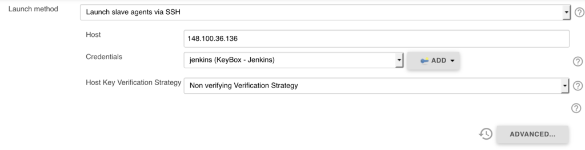
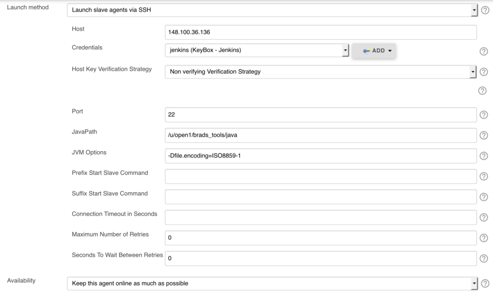

  
Adding zOS to a Jenkins server as an ssh agent can be a difficult task, that's why I've documented the steps that we were required follow to add our zOS machines to Jenkins.  

## Adding Java to zOS
  
All Jenkins build agents require Java to be on the machine to run the Slave agent. Normally an OpenJDK binary would be recommended to run the slave agent but there is no official zOS OpenJDK binary so I would recommend fetching IBM's Java from [here](https://www-03.ibm.com/systems/z/os/zos/tools/java/).

## Adding the Machine to Jenkins

Head over to `https://<jenkins-server>/computer/new`, specify a node name and tick permanent agent.  
  
  
  
Once you have reached the machine configuration page specify the Launch method as Launch slave agents via SSH. Set the host IP Address, Credentials and Host Key Verification Strategy and then click advanced.  
  

  
In the advanced page, set the JavaPath as the path to the Java binary that you downloaded earlier and then add the following to JVM Options:  
  
```
-Dfile.encoding=ISO8859-1
```

This will allow Jenkins to understand the Ebcdic output from Java on the machine.  
  
You should now be able to successfully launch the Jenkins Java agent on your zOS machines.
