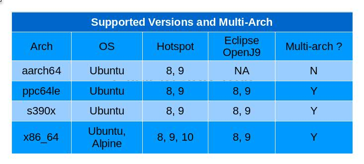

We are pleased to announce the availability of the Adopt OpenJDK **multi-arch** docker images!

The docker images are [available](https://hub.docker.com/r/adoptopenjdk) for both Hotspot and Eclipse OpenJ9. These images are built and published nightly and are based on the nightly builds from [here](https://adoptopenjdk.net/nightly.html). For more information on the Dockerfiles and related scripts, see the [github](https://github.com/AdoptOpenJDK/openjdk-docker) repo.

    
To get the latest version 9 images on any architecture (Hotspot on Ubuntu):

    $ docker pull adoptopenjdk/openjdk9:latest
    $ docker run --rm -it adoptopenjdk/openjdk9 java -version
    openjdk version "9-internal"
    OpenJDK Runtime Environment (build 9-internal+0-adhoc.jenkins.openjdk)
    OpenJDK 64-Bit Server VM (build 9-internal+0-adhoc.jenkins.openjdk, mixed mode)
    
Latest Version 8 Eclipse OpenJ9 on Ubuntu:

    $ docker run --rm -it adoptopenjdk/openjdk8-openj9 java -version
    openjdk version "1.8.0-internal"
    OpenJDK Runtime Environment (build 1.8.0-internal-jenkins_2017_11_22_15_06-b00)
    Eclipse OpenJ9 VM (build 2.9, JRE 1.8.0 Linux amd64-64 Compressed References 20171122_6 (JIT enabled, AOT enabled)
    OpenJ9 - 41b7b9b
    OMR - 76b44ef
    OpenJDK - 84153c7 based on jdk8u152-b16)

For latest Alpine Linux images:

    $ docker pull adoptopenjdk/openjdk9:alpine
    $ docker pull adoptopenjdk/openjdk9-openj9:alpine
    
You can get a specific release. Eg jdk8u152-b16

    $ docker pull adoptopenjdk/openjdk8:jdk8u152-b16
    $ docker pull adoptopenjdk/openjdk8:jdk8u152-b16-alpine
    $ docker pull adoptopenjdk/openjdk8-openj9:jdk8u152-b16
    $ docker pull adoptopenjdk/openjdk8-openj9:jdk8u152-b16-alpine
    
If you want a specific architecture, e.g. OpenJDK for aarch:

    $ docker pull adoptopenjdk/openjdk8:aarch64-ubuntu-jdk8u144-b01

Eclipse OpenJ9 and s390x:

    $ docker pull adoptopenjdk/openjdk8-openj9:s390x-ubuntu-jdk8u152-b16

To include the latest Eclipse OpenJ9 Alpine Linux image in a Dockerfile
    
    FROM adoptopenjdk/openjdk9-openj9:alpine
    RUN mkdir /opt/app
    COPY japp.jar /opt/app
    CMD ["java", "-jar", "/opt/app/japp.jar"]
