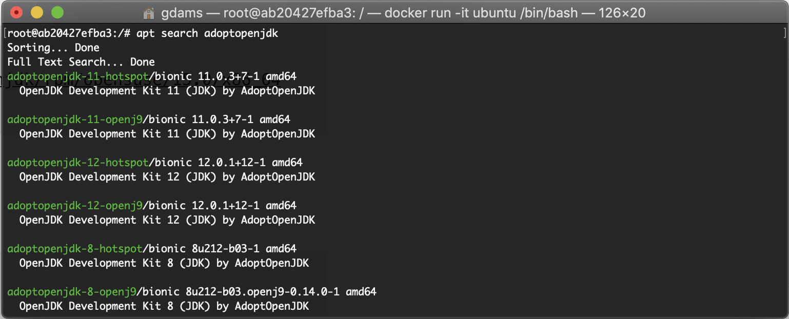

You asked and we listened! Official RPM and DEB files are now ready!


*Full list of currently supported AdoptOpenJDK versions*

## AdoptOpenJDK Package Names

The following name schema is being used:

**JDK**:

    adoptopenjdk-<version>-<jvm>

e.g. `adoptopenjdk-8-hotspot` or `adoptopenjdk-11-openj9`

**JRE**:

    adoptopenjdk-<version>-<jvm>-jre

e.g. `adoptopenjdk-8-hotspot-jre` or `adoptopenjdk-11-openj9-jre`

For the full matrix of supported platforms read the documentation [here](https://github.com/AdoptOpenJDK/openjdk-installer/blob/master/linux/README.md#support-matrix).

## Debian/Ubuntu Instructions

1. Import the official AdoptOpenJDK GPG key
    
    ```
    wget -qO - https://adoptopenjdk.jfrog.io/adoptopenjdk/api/gpg/key/public | sudo apt-key add -
    ```

2. Import the AdoptOpenJDK DEB repo using `add-apt-repository`. If you get a `command not found` error then try `apt-get install -y software-properties-common` first.
    
    ```
    sudo add-apt-repository --yes https://adoptopenjdk.jfrog.io/adoptopenjdk/deb/
    ```

3. Install the AdoptOpenJDK version you require
    
    ```
    apt-get update # update if you haven't already
    apt-get install adoptopenjdk-8-hotspot
    ```

## CentOS/RHEL/Fedora Instructions

1. Add the RPM repo to `/etc/yum.repos.d/adoptopenjdk.repo` making sure to change the centos version if you are not using **CentOS 7**. RPMs are also available for RHEL and Fedora. To check the full list of versions supported take a look at [https://adoptopenjdk.jfrog.io/adoptopenjdk/rpm](https://adoptopenjdk.jfrog.io/adoptopenjdk/rpm/).
    
    ```
    cat <<EOF > /etc/yum.repos.d/adoptopenjdk.repo
    [AdoptOpenJDK]
    name=AdoptOpenJDK
    baseurl=https://adoptopenjdk.jfrog.io/adoptopenjdk/rpm/centos/7/$(uname -m)
    enabled=1
    gpgcheck=1
    gpgkey=https://adoptopenjdk.jfrog.io/adoptopenjdk/api/gpg/key/public
    EOF
    ```

2. Install the openjdk version you require

    ```
    yum update # update if you haven't already
    yum install adoptopenjdk-8-hotspot
    ```

## openSUSE/SLES Instructions

1. Import the RPM repo making sure to change the openSUSE version if you are not using **OpenSUSE 15.0**. RPMs are also available for SLES 12 and 15. To check the full list of versions supported take a look at [https://adoptopenjdk.jfrog.io/adoptopenjdk/rpm](https://adoptopenjdk.jfrog.io/adoptopenjdk/rpm/).

    ```
    zypper ar -f https://adoptopenjdk.jfrog.io/adoptopenjdk/rpm/opensuse/15.0/x86_64/$(uname -m) adoptopenjdk
    ```

2. Install the AdoptOpenJDK version you require

    ```
    zypper install adoptopenjdk-8-hotspot
    ```

Please raise any issues over at [https://github.com/AdoptOpenJDK/openjdk-installer/issues](https://github.com/AdoptOpenJDK/openjdk-installer/issues).
