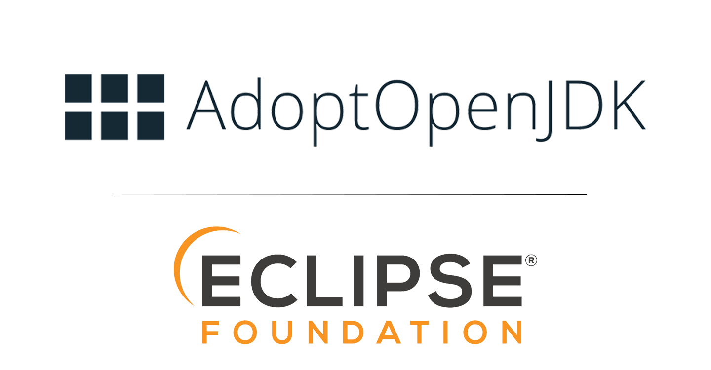

Since early 2017 Java™ developers, vendors, Fortune 500™ companies, end-users, hobbyists, and a multitude of other folks from the Java ecosystem have all come together at [AdoptOpenJDK](https://adoptopenjdk.net/) to solve an industry challenge of

_Providing the Java community with rock-solid runtimes and associated tools that can be used **free of charge, without usage restrictions on a wide range of platforms.**_

AdoptOpenJDK has proven to be a runaway success, with [over 165M downloads](https://dash-v2.adoptopenjdk.net/) of our binary distributions now powering Java workloads across the globe. However, technology is not built in isolation, and we consider the greatest success of AdoptOpenJDK to be the coming together of hundreds of people in an active, diverse, and enthusiastic community.

Currently, the AdoptOpenJDK project is legally backed by the non-profit [London Java Community CIC](https://londonjavacommunity.co.uk/) (aka the London Java User Group or LJC), which has served us well up to now. The LJC has kindly handled our accounts, signed contracts, and managed our legal obligations. However, now the time has come for AdoptOpenJDK to grow into its next stage of evolution. This next stage is a move to a large established software foundation.

## Why We Are Moving
In every open source project’s life comes a time to take the necessary steps to enshrine its independence and longevity in a proven cultural and legal framework. A project of AdoptOpenJDK’s size and scale also needs an awful lot of logistical support, and the cracks in some places are starting to show!

[The Technical Steering Committee (TSC)](https://github.com/AdoptOpenJDK/TSC#the-tsc) of AdoptOpenJDK investigated several options for moving AdoptOpenJDK to a software foundation or similar structure.  We researched many alternatives, and ultimately the [Eclipse Foundation](https://www.eclipse.org/) came out as the clear front runner.

## Moving to the Eclipse Foundation
The Technical Steering Committee (TSC) proposed that AdoptOpenJDK move to the Eclipse Foundation, and the Eclipse Board recently approved that proposal. Joining the Eclipse Foundation allows AdoptOpenJDK to continue to grow and to focus on our mission.

Furthermore, becoming part of the Eclipse family strengthens our vendor independence while maintaining a strong relationship with existing sponsors and the Java community as a whole.  

The Eclipse Foundation has a deep history with the Java ecosystem. It provides proven structures for strong, vendor-neutral project governance, IP flow protection, as well as world-class marketing, legal, and hosting support.

## What It Means For Our Name
As part of a move to the Eclipse Foundation, we will undergo a project rename. Of course, we respect existing trademarks, and while the project would retain a close association with the work at OpenJDK, we don’t want anyone to be confused by our current name similarity. 

The new project name will be Eclipse Adoptium. Adoptium is a compound word of “AdoptOpenJDK” and the Latin suffix “-ium”.

```java
var newProjectName = new String("Eclipse Adoptium");
```

## What It Means for Our Users
Apart from the new name, any visible changes are going to be minor. In time, some services, websites, and APIs would move to new URLs, and some package names might change. Everything will be announced well in advance on a per-service basis with long transition periods. We will make the transition as smooth as possible.

Everything else will stay the same. Our core mission, the code, its licensing, and the people behind the project (including you!). Our infrastructure will remain independent, and we will be providing you with the same high-quality releases on our usual schedule. Everybody is welcome to join in the fun and collaborate with us on [GitHub](https://www.github.com/adoptopenjdk) and [Slack](https://adoptopenjdk.net/slack.html) as before.

## What it Means for Our Sponsors
A big thank-you to [the existing sponsors](https://adoptopenjdk.net/sponsors.html) who have helped us reach this important milestone in our journey.  We envisage that there will be multiple ways that **new and existing** sponsors can support the work of the project at Eclipse. The details of membership and sponsorship are still being discussed with the Eclipse Foundation. We look forward to sharing the options with you in time.  Please drop us a note if you are interested in supporting us on this exciting stage of the journey.

## What It Means For The Governance Structure
At the [Eclipse Foundation](https://www.eclipse.org/org/), the work undertaken by the existing AdoptOpenJDK Technical Steering Committee will effectively be split into two separate roles.

One is the **Project Management Committee (PMC)**. The PMC is for the technical leaders of the project who will steer the day to day technical direction for the project. It will consist of all of the "doers" you see today!

The **[Working Group](https://www.eclipse.org/org/workinggroups/)** will be a separate entity which deals with the dollars and cents and other issues such as licensing, legal, marketing, and so forth.  Membership is more structured here to ensure vendor neutrality.

Folks can serve on both of those committees, but over time you may see them diverge in terms of personnel.

## Feedback on the Proposal
Everybody is welcome to send us a private [email](mailto:tsc@adoptopenjdk.net), leave public comments on the [GitHub issue](https://github.com/AdoptOpenJDK/TSC/issues/160) and join us to chat in the #general channel of our [Slack](https://adoptopenjdk.net/slack.html) workspace.  We look forward to hearing from you.

This is an exciting time for the AdoptOpenJDK project!  Thank you to everyone who has contributed to our success so far, as a user or developer, as a supporter or sponsor.  We could not have done it without each of you. We have ambitious plans for the future and are thrilled to be taking the project to the next level as part of the Eclipse Foundation.

Cheers,

The [Technical Steering Committee](mailto:tsc@adoptopenjdk.net).