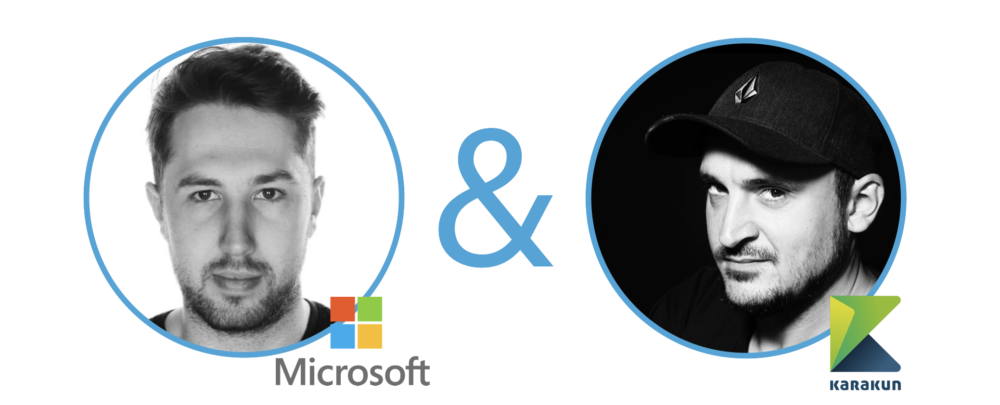

Join the AdoptOpenJDK virtual roadshow as we speak at a JUG near you!

AdoptOpenJDK is doing a virtual roadshow of the Java User Groups. We plan to reach as many groups as possible but we will also live stream the event on YouTube.

## Abstract
AdoptOpenJDK is the leading provider of OpenJDK™ binaries. With over 170 million downloads in the last year, it is successfully used by many enterprises and ready for your production usage of Java™. AdoptOpenJDK provides prebuilt OpenJDK binaries from a fully open source set of build scripts and infrastructure. This talk will cover how we build on over 15 different platforms, execute over 87 million tests and distribute OpenJDK binaries to millions of users. We will also cover how AdoptOpenJDK binaries compare against the Java binaries that you use today. If you're curious to understand the difference between OpenJDK, Oracle Java, AdoptOpenJDK and all the other distributions, then this is the talk for you!

## Speakers

**George Adams** is the Java Program Manager at [Microsoft](https://www.microsoft.com) and is the recently appointed chair of the Technical Steering Committee at AdoptOpenJDK. Since co-founding AdoptOpenJDK in 2016 he has been leading the community outreach efforts at AdoptOpenJDK and is heavily involved in the Java ecosystem. George also contributes to both the OpenJS Foundation and the Node.js Foundation where he is a core collaborator and plays an active role in several of the workgroups.

**Hendrik Ebbers** is a co-founder of [Karakun AG](https://www.karakun.com) and lives in Dortmund, Germany. He is the founder and leader of the Java User Group Dortmund and gives talks and presentations in user groups and conferences. His JavaFX book "Mastering JavaFX 8 Controls" was released in 2014 by Oracle press. Hendrik is a JavaOne Rockstar, JSR expert group member and Java Champion. Hendrik is a member of the AdoptOpenJDK TSC.

## Scheduled Events
| Date | JUG / Conference | Link |
|---|---|---|
| 21/07/2020 18:30 EDT | Knoxville JUG  |  https://www.meetup.com/KnoxJava/events/nmfmbrybckbcc/ |
| 06/08/2020  19:00 GMT+3 | JUG Istanbul |  https://www.meetup.com/Istanbul-Java-User-Group/events/271767087 |  
| 11/08/2020  11:00 EDT | Connecticut JUG  | https://www.meetup.com/Connecticut-Java-Users-Group/events/271934054/ |
| 12/08/2020 | JUG Switzerland  | https://www.jug.ch/html/events/2020/adoptopenjdk.html |
| 18/08/2020 | JUG Dortmund  | https://www.meetup.com/JUG-Dortmund/events/272181147/ |
| 19th-22nd October | Eclipse Con 2020 | https://www.eclipsecon.org/2020/sessions/adoptopenjdk-making-java-free-again |
| 22/09/2020 | JUG Freiburg | tbd |
| 24/09/2020 | Java Forum Stuttgart | https://www.java-forum-stuttgart.de/de/Slot+6+2020.html#C6 |
| 03/10/2020 | JConf Mexico 2020 | tbd |
| 02/11/2020 | DWX Developer Week | https://www.developer-week.de/programm-2020/#/talk/adoptopenjdk-was-ist-das-eigentlich |
| 04/11/2020 | wJAX | https://jax.de/core-java-jvm-languages/adoptopenjdk-was-ist-das-eigentlich/ |
| 29/10/2020 | JCON 2020 | https://jcon.one/en/ |

## Upcoming Events
We will update this as soon as we have dates/links.
- Enterprise Java User Group Austria
- Guadalajara JUG
- Rochester (NY) JUG
- SouJava

## Recorded Sessions
Some of our sessions have been recorded:
- [AdoptOpenJDK at JUG Switzerland](https://www.youtube.com/watch?v=KvpibYDRSUo)
- [AdoptOpenJDK at Istanbul JUG](https://www.youtube.com/watch?v=jUSzWj0zMus)

## Slide Deck
You can find our slides at [Speakerdeck](https://speakerdeck.com/hendrikebbers/adoptopenjdk-making-java-free-again).

## Your JUG?
If you would like to host "AdoptOpenJDK - Making Java free again" at your local JUG then please email tsc@adoptopenjdk.net.
