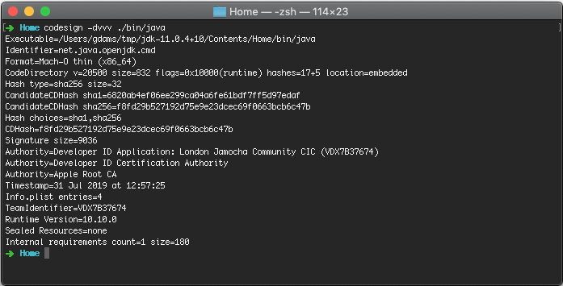

Some changes have been made to the way we codesign our macOS binaries.

*`codesign` verification of a hardened runtime*

## Summary

Apple has recently changed the requirements for applications to install on macOS 10.15 and above. The change requires developers to notarize the application before it gets shipped. Notarization involves submitting the application to Apple to be scanned and generates a JSON report with any issues. More information about notarization can be found [here](https://developer.apple.com/documentation/security/notarizing_your_app_before_distribution).

## What’s changed?

We have enabled hardened runtime on our macOS binaries which will allow them to be bundled into applications and pass Apple’s Notarization tests. OpenJDK 11+ will work out of the box, OpenJDK8 needs a bit more work because it’s built on an older toolchain that the notarization test doesn’t support. We will be creating a second release of [jdk-11.0.4+11](https://github.com/AdoptOpenJDK/openjdk11-binaries/releases/tag/jdk-11.0.4%2B11) and [jdk-12.0.2+10](https://github.com/AdoptOpenJDK/openjdk12-binaries/releases/tag/jdk-12.0.2%2B10) which will have hardened runtime enabled.

## The issue

We had multiple bug reports from users saying that when they bundle AdoptOpenJDK binaries into their applications, the notarization fails with multiple errors such as the ones below:

    “message”: “The signature algorithm used is too weak.”,
    “message”: “The executable does not have the hardened runtime enabled.”,

In order to work around this, we have had to enable hardened runtime on our binaries when we codesign them.

This requires us to add --options runtime to the codesign command. It also requires us to enable the following entitlements:

    <?xml version="1.0" encoding="UTF-8"?><!DOCTYPE plist PUBLIC "-//Apple//DTD PLIST 1.0//EN" "http://www.apple.com/DTDs/PropertyList-1.0.dtd"><plist version="1.0">
    <dict>    
      <key>com.apple.security.cs.allow-jit</key>
      <true/>
      <key>com.apple.security.cs.allow-unsigned-executable-memory</key>
      <true/>            
      <key>com.apple.security.cs.disable-executable-page-protection</key>
      <true/>
      <key>com.apple.security.cs.allow-dyld-environment-variables</key>
      <true/> 
    </dict>
    </plist>

### Why can’t I bundle OpenJDK8?

If you try and bundle our OpenJDK8 binaries you will receive the following notarization failure:

    "message": "The binary uses an SDK older than the 10.9 SDK.",

This is because OpenJDK8 is designed to be built on a much older toolchain. We will work closely with the wider community to get a fix that allows OpenJDK8 to be built on a newer version of Xcode. As soon as this is ready we will be able to build an OpenJDK8 hardened runtime enabled binary.
