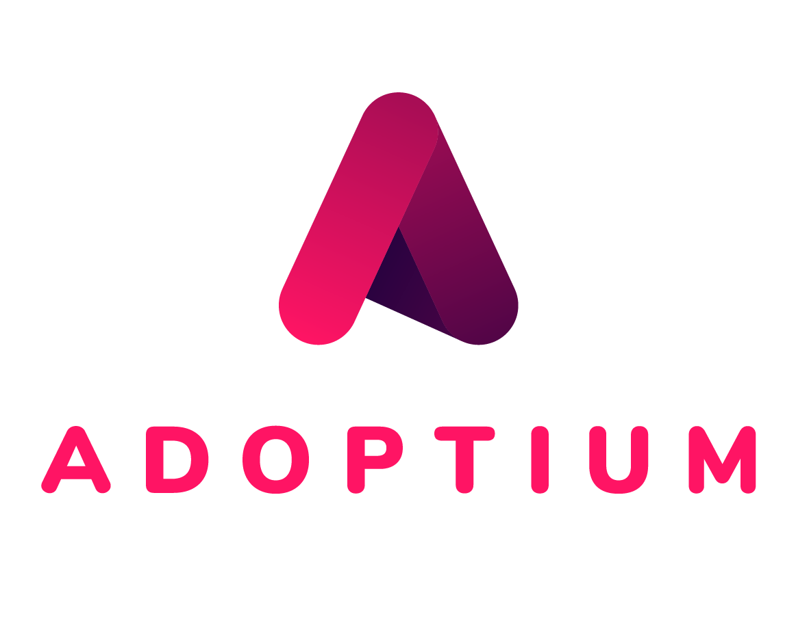

After months of hard work, the migration process from [AdoptOpenJDK](https://adoptopenjdk.net) to Eclipse Adoptium has begun!

Firstly we'd like to take this opportunity to thank the [Eclipse Foundation](https://www.eclipse.org/) for how supportive they have been throughout this entire process. Moving an active open source project with over a quarter of a billion downloads is no small feat! Especially when you throw a rebrand into the equation at the same time. There are several key changes to the project assets that have been summarised below.

### New Name & Logo
As part of the move to the Eclipse Foundation, we decided to rebrand and change the name from AdoptOpenJDK to Adoptium:

Many of you will have seen the new logo rollout to GitHub, Twitter, Slack and more over the last few days!

### New Locations
Several of our online locations have also been changed over the last few days:

| Account | Old Name | New Name |
| --- | --- | --- |
| Website | [adoptopenjdk.net](https://adoptopenjdk.net) | [adoptium.net](https://adoptium.net) |
| Blog | [blog.adoptopenjdk.net](https://blog.adoptopenjdk.net) | [blog.adoptium.net](https://blog.adoptium.net) |
| GitHub | [AdoptOpenJDK](https://github.com/adoptopenjdk) | [Eclipse Adoptium](https://github.com/adoptium) |
| Twitter | [@adoptopenjdk](https://twitter.com/adoptopenjdk) | [@adoptium](https://twitter.com/adoptium) |
| Slack | [adoptopenjdk.slack.com](https://adoptopenjdk.slack.com) | [adoptium.slack.com](https://adoptium.slack.com) |
| YouTube | [AdoptOpenJDK](https://www.youtube.com/c/AdoptOpenJDK) | [EclipseAdoptium](https://www.youtube.com/c/EclipseAdoptium) |

In most cases we have been able to leave a forward pointer from the old to the new location, but there may still be places we need to fixup. The AdoptOpenJDK website and it's binaries will not be going anywhere for a long time.

### When will Adoptium begin producing binaries?
The Adoptium working group will be promoting a number of high-quality binaries, including the group's own Temurin binaries which will be produced by the [Eclipse Temurin](https://projects.eclipse.org/projects/adoptium.temurin) project. It will take some time to fully migrate our build farm and code, so in the meantime [AdoptOpenJDK](https://adoptopenjdk.net) will continue to make binaries available as usual. The current expectation is that the first formal release of Eclipse Temurin binaries will be the July quarterly updates. For more information about the project structure see our recent blog [Transition to Eclipse - An Update](https://blog.adoptium.net/2021/03/transition-to-eclipse-an-update/). Make sure to monitor this blog and [adoptium.net](https://adoptium.net) for more updates!
