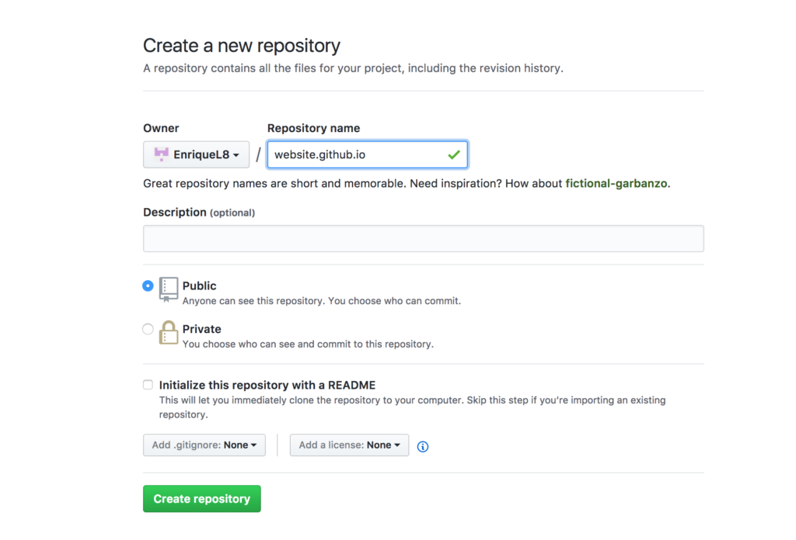
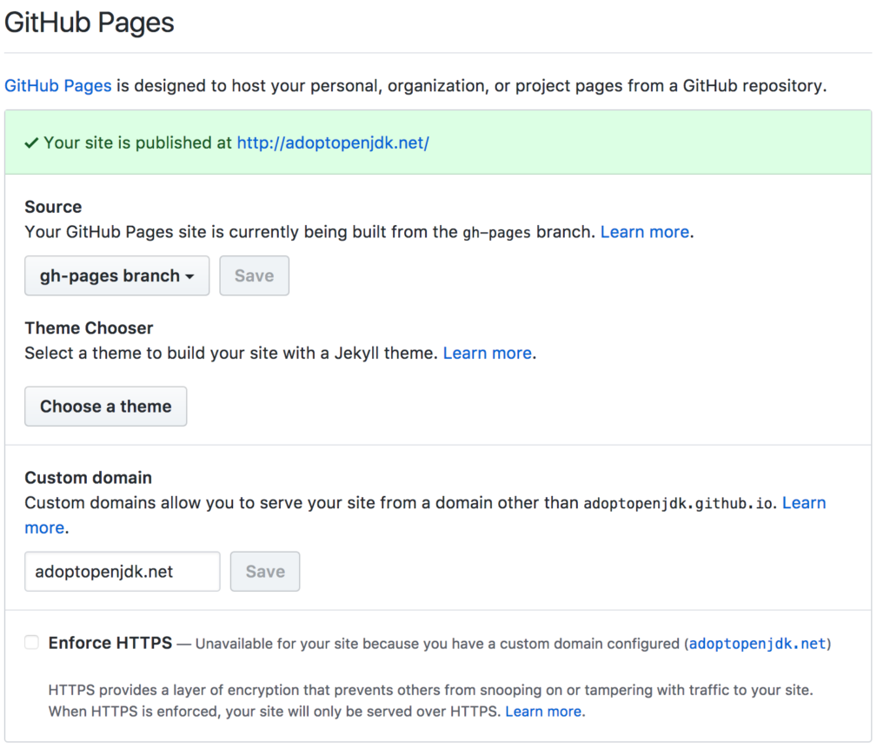
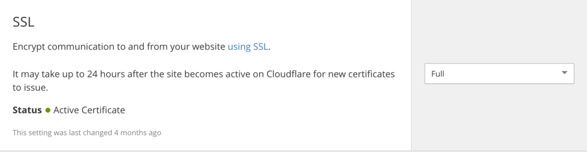

GitHub Pages offers the ability to host static websites from a GitHub Repository and it can be linked to CloudFlare using a custom domain name. Though it does not support SSL on custom domains, we can use CloudFlare Universal SSL to allow our users to access the website over SSL.

## Only static HTML?

Even though GitHub Pages only has the ability to host static content it isn't such a big cutback. This means that the web server only needs to deliver a static HTML to the end user, resulting in performance benefits. Furthermore, using the git repository we can track site changes and thus having a better control when shared coding.

## Creating a GitHub Repository

Creating a GitHub Repository that contains the HTML files.

## Enabling GitHub Pages

Once we have created our GitHub Repository, we need to enable GitHub Pages in Settings and specify a branch that will built the website, the default is the master branch. If we use a custom domain, we change the default domain to point to our custom domain.

## Setting up DNS

After having registered the custom domain and added it to CloudFlare.

We need to setup the CNAME file, in our GitHub Repository, which declares the hostname to accept traffic from.

## Configuring SSL

GitHub Pages doesn’t yet support SSL for custom domains and thus ruling out HTTP/2. How can we get past it?
CloudFlare’s Universal SSL option give us the ability to provide a signed SSL certificate to site visitors thus gaining the performance benefits of HTTP/2. To set it up, we set the SSL mode to FULL in Cloudflare.

To enforce more restrictions we can add a page rules. For example, a page rule to enforce HTTPS.

