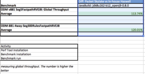
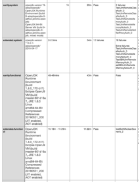

Before I dabble in the juicy world of computer architectures and measuring and understanding performance implications, let me premise this entire post with a quick introduction to myself.

I am not a performance analyst, nor am I a low-level software developer trying to optimize algorithms to squeeze out the last ounce of performance on particular hardware.

While I am fortunate to work with people who have those skills, I myself am a 'happy-go-lucky' / high-level software developer.  My focus in the last few years has been developing my skills as a verification expert.  I have a particular interest in finding solutions that help testing software easier and more effective.  One flavour of software verification is performance testing.

While I am fairly new to performance benchmarking,  I am experienced in streamlining processes and tools to reduce the friction around common tasks.  If we want to empower developers to be able to benchmark and test the performance impact that their changes, we need to create tools and workflows that are dead easy.  I personally need it to be dead easy!  "[Not only am I the hair club president, I am also a client](https://www.youtube.com/watch?v=IuRLGdGnqSU)".   I want to be able to easily run performance benchmarks and at some level understand the results of those benchmarks.  (This seems like a good time to segue to the recent open-sourcing of tools that help in that effort, [PerfNext](https://github.com/AdoptOpenJDK/openjdk-test-tools#perfnext)/[TRSS](https://github.com/AdoptOpenJDK/openjdk-test-tools#test-result-summary-service-trss) and [Bumblebench](https://github.com/AdoptOpenJDK/bumblebench)... more to come on that later in preparation for "[Performance Testing for Everyone](https://www.eclipsecon.org/europe2018/sessions/java-performance-testing-everyone)" at EclipseCon Europe).

But back to the current story, a wonderful opportunity presented itself.   We have the great fortune at the AdoptOpenJDK project to work with many different teams, groups and sponsors.  [Packet](https://www.packet.net/), a cloud provider of bare-metal servers, is one of our sponsors who donates machine time to the project allowing us to provide pre-built and tested OpenJDK binaries from [build scripts](https://github.com/AdoptOpenJDK/openjdk-build) and infrastructure.  They are very supportive of open-source projects, and recently offered us some time on one of their new [Intel® Optane™ SSD servers](https://www.acceleratewithoptane.com/access) (with their Skylake microarchitecture).

Packet and AdoptOpenJDK share the mutual goal of understanding how these machines affect Java™ Virtual Machine (JVM) performance.  Admittedly, I attempted to parse all of the information found in the [Intel®](https://www.intel.com/content/dam/www/public/us/en/documents/manuals/64-ia-32-architectures-optimization-manual.pdf)[ 64 and IA-32 Architectures Optimization Manual](https://www.intel.com/content/dam/www/public/us/en/documents/manuals/64-ia-32-architectures-optimization-manual.pdf), but needed some help. Skylake improves on the Haswell and Broadwell predecessors.  Luckily, Vijay Sundaresan, WAS and Runtimes Performance Architect, took the time to summarize some features of the Skylake architecture.  He outlined those features having the greatest impact on JVM performance and therefore are of great interest to JVM developers.  Among the improvements he listed :
 	
* Skylake's 1.5X memory bandwidth, higher memory capacity at a lower cost per GB than DRAM and better memory resiliency
* Skylake cache memory hierarchy is quite different to Broadwell, with one of the bigger changes being that it stopped being inclusive
* Skylake also added AVX-512 (512 bytes vector operations) which is a 2X improvement over AVX-256 (256 bytes vector operations)

Knowing of those particular improvements and how a JVM implementation leverages them, we hoped to see a 10-20% improvement in per-core performance.  This would be in keeping with the [Intel®](https://www.intel.com/content/dam/www/public/us/en/documents/manuals/64-ia-32-architectures-optimization-manual.pdf)[ published SPECjbb®2015 benchmark](https://www.spec.org/jbb2015/results/jbb2015.html)** (the de facto standard Java™ Server Benchmark) scores showing improvements in that range.

We were not disappointed.  We decided to run variants of the ODM benchmark.  This benchmark runs a Rules engine typically used for automating complex business decision automation, think analytics (compliance auditing for Banking or Insurance industries as a use case example).  Ultimately, the benchmark processes input files.  In one variant, a small set of 5 rules, in the other a much larger set of 300 rules was used.  The measurement tracks how many times a rule can be processed per second, in other words, it measures the throughput of the Rules engine with different kinds of rules as inputs.  This benchmark does a lot of String/Date/Integer heavy processing and comparison as those are common datatypes in the input files.  Based on an average of the benchmark runs that were run on the Packet machine, we saw a healthy improvement of 13% and 20% in the 2 scenarios used.

*Summary of ODM results*

*ODM results from PerfNext/TRSS graph view*

We additionally ran some of our other tests used to verify AdoptOpenJDK builds on this machine to compare the execution times... We selected a variety of OpenJDK implementations (hotspot and openj9), and versions (openjdk8, openjdk9, and openjdk10), and are presenting a cross-section of them in the table below.  While some of the functional and regression tests were flat or saw modest gains, we saw impressive improvements in our load/system tests.  For background, some of these system tests create hundreds or thousands of threads, and loop through the particular tests thousands of times.  In the case of the sanity group of system tests, we went from a typical 1 hr execution time to 20 minutes, while the extended set of system tests saw an average 2.25 hr execution time drop to 34 minutes.

To put the system test example in perspective, and looking at our daily builds at AdoptOpenJDK, on the x86-64_linux platform, we have typically 3 OpenJDK versions x 2 OpenJDK implementations, plus a couple of other special builds under test, so 8 test runs x 3.25 hrs = 26 daily execution hours on our current machines.  If we switched over to the Intel® Optane™ machine on Packet, would drop to 7.2 daily execution hours.  A tremendous savings, allowing us to free up machine time for other types of testing, or increase the amount of system and load testing we do per build.

The implication?  For applications that behave like those system tests, (those that create lots of threads and iterate many times across sets of methods, including many GUI-based applications or servers that maintain a 1:1 thread to client ratio), there may be a compelling story to shift.

*System and functional test results and average execution times*

Having this opportunity from Packet, has provided us a great impetus to forge into "open performance testing" story for OpenJDK implementations and some of our next steps at AdoptOpenJDK.  We have started to develop tools to improve our ability to run and analyze results.  We have begun to streamline and automate performance benchmarks into our CI pipelines.  We have options for bare-metal machines, which gives us isolation and therefore confidence that results are not contaminated by other services sharing machine resources.  Thanks to Beverly, Piyush, Lan and Awsaf for getting some of this initial testing going at AdoptOpenJDK.  While there is a lot more to do, I look forward to seeing how it will evolve and grow into a compelling story for the OpenJDK community.

Special thanks to Vijay, for taking the time to share with me some of his thoughtful insights and great knowledge!  He mentioned with respect to Intel Skylake, there are MANY other opportunities to explore and leverage including some of its memory technologies for Java™ heap object optimization, and some of the newer instructions for improved GC pause times.  We encourage more opportunities to experiment and investigate, and invite any and all collaborators to join us.  It is an exciting time for OpenJDK implementations, **innovation happens in the open**, with the help of great collaborators, wonderful partners and sponsors!

** SPECjbb®2015 is a registered trademark of the Standard Performance Evaluation Corporation (SPEC).
