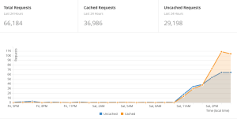

What a crazy last week it has been for everyone at AdoptOpenJDK. We are very excited to have begun adding OpenJ9 builds to our website! The interest has been overwhelming and it was incredible to see our website reach well over 250,000 hits after a small thread on Reddit quickly became much more!<!-- excerpt-end --> The picture below from our Cloudflare analytics tool shows very clearly when the post was added to Reddit and the views kept pouring in for the rest of the day.

*Cloudflare traffic stats*

## Platform Support

We currently only have builds for x86, s390x and ppc64le Linux but we plan to add Windows, macOS and many more as soon as the OpenJ9 team is ready. The easiest way to download them is at [adoptopenjdk.net](https://adoptopenjdk.net/releases.html?variant=openjdk9-openj9).

To read more about the advantages of using OpenJ9 over Hotspot read the OpenJ9 FAQ [here](https://www.eclipse.org/openj9/oj9_faq.html).
