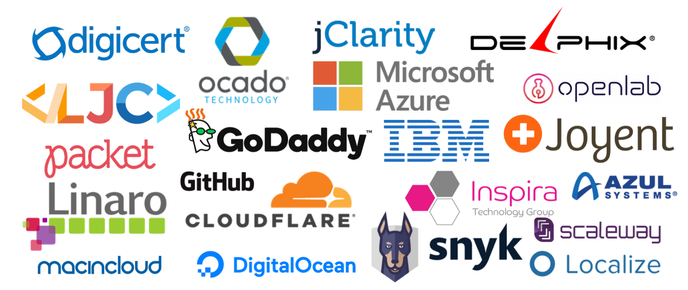

Do you want to sponsor the AdoptOpenJDK project?

*Current AdoptOpenJDK sponsors, April 2019 ([https://adoptopenjdk.net/sponsors](https://adoptopenjdk.net/sponsors.html))*

## Thank you to our sponsors

Before we get started I just want to say a massive thank you to all the incredible companies that already sponsor the AdoptOpenJDK project! Without your generous donations, the project simply wouldn’t be able to run and continue to grow at the rate that it already does.

## Why should you sponsor AdoptOpenJDK?

We believe that OpenJDK™ / Java™ is part of the public good. AdoptOpenJDK’s mission is to produce professionally tested OpenJDK™ binaries for as many platforms, architectures, and versions as possible. These binaries are ​$free​ (of cost) and ​free​ to use (under open source licenses) and kept up to date as long as the upstream OpenJDK™ and Eclipse OpenJ9 projects update their source code.

## Who really runs AdoptOpenJDK?

AdoptOpenJDK’s direction is steered by its individual members and there is a ​Technical Steering Committee​ in place to ensure broad and fair representation.

## Who’s using AdoptOpenJDK?

We already have 20M+ downloads for our builds. Everyone from individual developers to Fortune 500’s are relying on AdoptOpenJDK binaries.

## Where you can help

There are a variety of ways that organizations and their members can help AdoptOpenJDK fulfill its mission.

### Engineering Support

1. **Devops**​​ — Especially related to Ansible, O/S administration knowledge. Our goal is to have all hosts regularly wiped and rebuilt using Ansible and other immutable infrastructure techniques.
2. **Build**​​ — We run a Jenkins pipeline builds which require Jenkins, Groovy, C/C++, Bash knowledge to maintain.
3. **Web**​​ — We’re looking to rewrite the website in a modern framework guided by strong Ux and a UI that delights.
4. **Security**​​ — AdoptOpenJDK needs to protect itself against bad actors up to and including state-sponsored actors.

### Infrastructure Requirements

We are currently looking for multiple hosts for build and test across various platforms that have significant CPU and memory. This will be used to quickly and continuously build and test multiple versions of OpenJDK.

Linux-x64 hardware is always useful for hosting key services and allows us to provide good test coverage across all distributions. We are also looking for some of the more specialized platforms to be added to our build farm (machines that often cost much more to pay for in the cloud). Our general guideline for build machines is:

**4+ core** ​​CPU ​​**8GB**​​ RAM and ​​**120+ GB**​​ Disk (preferably ​​**SSD**​​)

### Financial Sponsorship

Direct financial sponsorship helps ensure that the infrastructure and 3rd party services we rely on have long-term stability. As the project grows in size, so do these costs and so we are always looking for more financial sponsors to join the project. If you are interested in financial sponsorship of the project and want to find out more about the costs associated etc, then please email us at [sponsorship@adoptopenjdk.net](mailto:sponsorship@adoptopenjdk.net).
