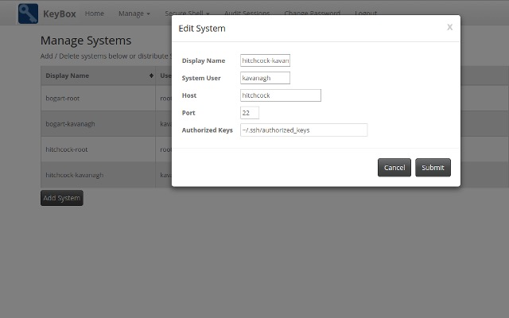
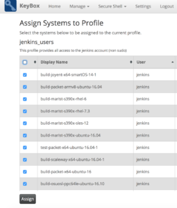
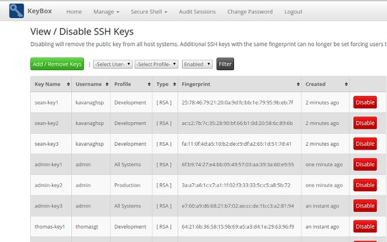

Any project with more than a handful of machines will appreciate how much work is required to maintain them and ensure that access is kept to the minimum number of people. When we started creating our build farm we quickly realised how time-consuming this could be and so we wanted to find a neat solution to save us some time. One of the biggest issues that we found was giving people temporary access to machines. We would often find that the access was never revoked and this therefore became an administrators nightmare.

Whilst searching on the internet I came across an open-source project named KeyBox. KeyBox is a web-based SSH console that centrally manages administrative access to systems. It is super easy to setup and we decided to run it on one of our machines bundled with Jetty. After downloading a tar.gz file, there are just a handful of commands to run before you have a fully functioning KeyBox server. One of the other really great features is that you can install [FreeOTP](https://freeotp.github.io/) or [Google Authenticator](https://github.com/google/google-authenticator) to enable two-factor authentication with Android or iOS.

Once you have a running instance of KeyBox you can start to change your configuration to suit what you need. We decided that we wanted to use our own existing public ssh keys rather than having KeyBox generate one, so we had to change the `KeyBoxConfig.properties` file. This file can be found at `KeyBox-jetty/jetty/keybox/WEB-INF/classes`. Simply edit this file with your favourite editor and change the line:

```
# set to true to generate keys when added/managed by users and enforce strong
# passphrases set to false to allow users to set their own public key
forceUserKeyGeneration=true
```

to be:

```
# set to true to generate keys when added/managed by users and enforce strong
# passphrases set to false to allow users to set their own public key
forceUserKeyGeneration=false
```

Then simply save your config and restart KeyBox using `./startKeyBox.sh`  

## Adding a Machine

The first thing I did when I got KeyBox was add some of our machines. It's really simple to add machines, you just need to click 'Systems', 'Add System' and then fill in a display name, system user, and host (leave the port and Authorized Keys fields as default).  



Once you click 'Submit', KeyBox will make an ssh connection to the machine. You will be prompted to enter the password for the user but you should only need to do this once. This is where the magic now happens.... KeyBox will erase all of your authorized_keys and add its own public key. One thing to consider is that when you add a new system, you are only adding it for that one single user so you may want to add the system multiple times (in our case we have a sudo user on every machine as well as a jenkins user with no administrative permissions.  

## Assigning systems to profiles

Once you've added some machines to KeyBox the next obvious thing to do is start assigning machines to profiles. The idea behind profiles is that you can create pools of machine access that you can then assign ssh keys to. For example in our case, we have a jenkins profile which contains all of the systems with jenkins user access. You may also want to create a Mac profile or a Linux profile to allow users access to certain operating systems only. Creating profiles is simple, you just navigate to the profiles page, click 'Add Profile' and then set and name and optional description. Once you have done that you can click 'Assign Systems' and tick which machines you want to assign to that profile.

  

## Adding SSH Keys

This is the last step for us, you have successfully added all of your machines and assigned access profiles to them, you now want to give people access. As I mentioned above, we wanted users to be able to send me their existing public key, and for that key to be added to all machines that they need rather than generating keys and sending them back to the user. This way seemed more logical to me as it prevents users ending up with several keys to get lost on their system.

  

To add a users key, simple click 'Add/Remove Keys', copy in their public key, specify which profile to assign the key to and then click 'Submit'. This is a great way to handle key management as it means that the administrator has one simple view to see all machine access by every user.  

## Other features

KeyBox has several other great features such as two-factor authentication, web based terminal sessions and group code execution but I haven't tested those features enough to write about them yet. All in all, KeyBox is a great tool, that I would recommend to any open-source project that needs better control when it comes to ssh key management.

Find our more at http://sshkeybox.com/.
