As we support more and more tests, projects and Jenkins servers, monitoring builds health and triaging tests daily is quickly becoming an overwhelming task. We are currently maintaining 6+ Jenkins servers both internally and externally.

Some external Jenkins server examples that we monitor are:

* [https://ci.adoptopenjdk.net/](https://ci.adoptopenjdk.net/)
* [https://ci.eclipse.org/openj9/](https://ci.eclipse.org/openj9/)
* [https://ci.eclipse.org/omr/](https://ci.eclipse.org/omr/)

## Motivation/Challenge

We encounter 4 main challenges that have motivated us to develop TRSS.

### Multiple Jenkins servers to monitor

Even though we use Jenkins plugins at each particular Jenkins server for sending build status messages, without a build status overview it is hard to triage failure.

### Need for longer-term storage of test results

Secondly, we may want to keep results for a longer period of time for some tests, so we can compare the results with history runs. For example, we may want to keep performance test results for months or even years. Jenkins server often has limited storage and we can only store limited number of builds.

### Need for specialized views like side-by-side comparison

The third problem is that we do not have a tool to view/compare test results. Some type of tests is best to compare result with previous releases, previous builds or different platforms within the same build. Additionally, some type of tests are best displayed in graph to see the trends.

### Desire for customized views (tailored by each user)

Last but not the least, different users may be interested in different builds. For example, developers may want to only monitor their own personal builds. The FV team maybe only interested in functional test builds. The SV team maybe only interested in system test builds. A project manager may want to know overall test builds status.

We wanted a tool to monitor multiple Jenkins servers and display different type of test build results and history (test log files, compare test result across builds/platforms, display trends, etc.) And it needs to be highly customizable per user.

## Solution

To solve the issues listed above, we have started creating a thin-layer service called the Test Result Summary Service (TRSS).  You can find the source in [https://github.com/AdoptOpenJDK/openjdk-test-tools](https://github.com/AdoptOpenJDK/openjdk-test-tools).

### Key Features

#### Personalized Dashboard

TRSS can monitor multiple Jenkins servers in real-time. User can add/remove builds, add/remove/rearrange the panels/widgets. User’s modification is stored in each user’s browser local storage, so everyone can have their own customizable view and store their configuration without interfering with others.

*Personalized Dashboard*

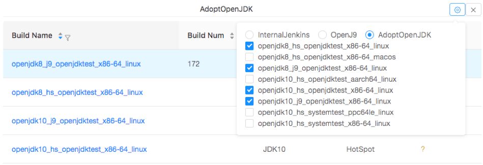
*Personalized Dashboard - add/remove builds*

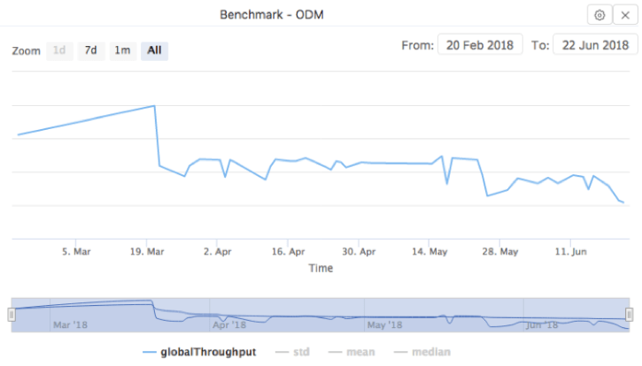
*Personalized Dashboard - test trend*

#### Test Result View

Other than monitor multiple Jenkins servers in real-time. TRSS also stores test history data.

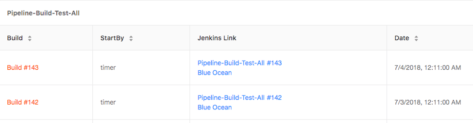
*Test Build View*

Downstream builds that are launched by above parent build pipelines:

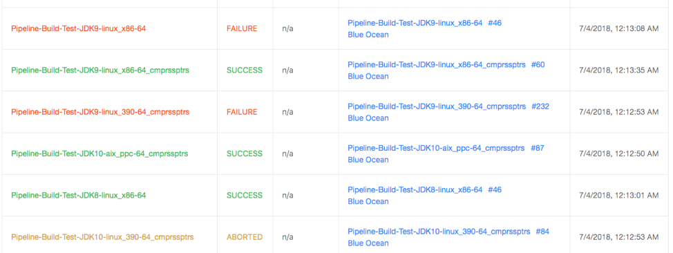
*Downstream Build View

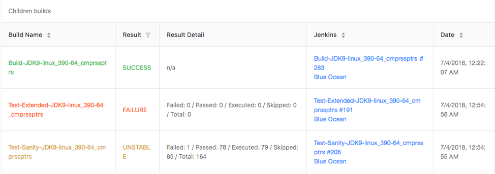 Downstream Build View

List of all tests within the build. In this view, TRSS displays test name, test result, test duration and test result history. Columns can be sorted or filtered (to only show FAILED tests or to sort them to the top of the list).

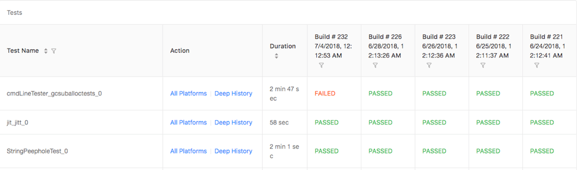 Test Result Summary

From above view, we easily tell _cmdLineTester_gcsuballoctests_0_ failed. _All Platforms_ shows _cmdLineTester_gcsuballoctests_0_ test result for all platforms and JDK version in the build.

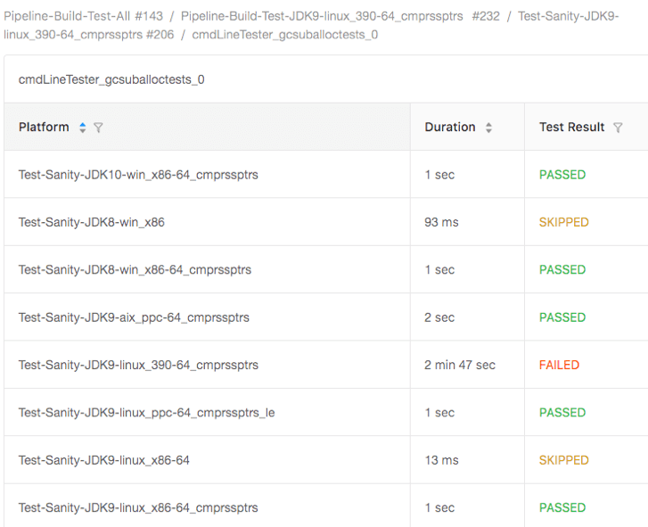 Test in All Platforms

_Deep history_ shows _cmdLineTester_gcsuballoctests_0_ test execution history on Linux s390.

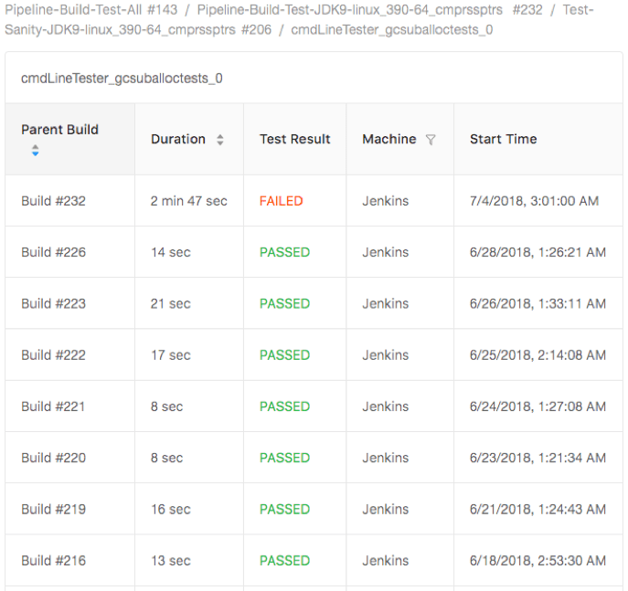 Test History

TRSS also displays the test output (as one would see in an individual Jenkins server console view of the test build). Below is _cmdLineTester_gcsuballoctests_0_ test output.

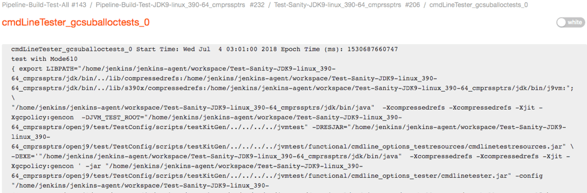 Test Output

#### Test Compare

TRSS can compare any test output (regardless of test type, build, platforms, etc).  With information for Jenkins server, build name, build name and test name, TRSS can search database and compares test output side by side.  This is an extremely simple but effective way to speed triage by comparing a passed build to a failed one and quickly identifying differences.

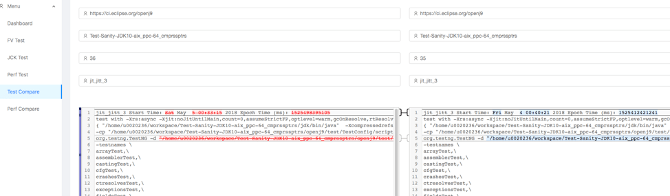 Test Output Compare

## Implementation Detail

TRSS uses node.js as server and React as client. It actively monitors multiple Jenkins servers and their jobs. TRSS parses the jobs outputs and store parsed data into MongoDB. If needed, it also stores links to Artifactory for extra data (i.e., logs, core files, erc).

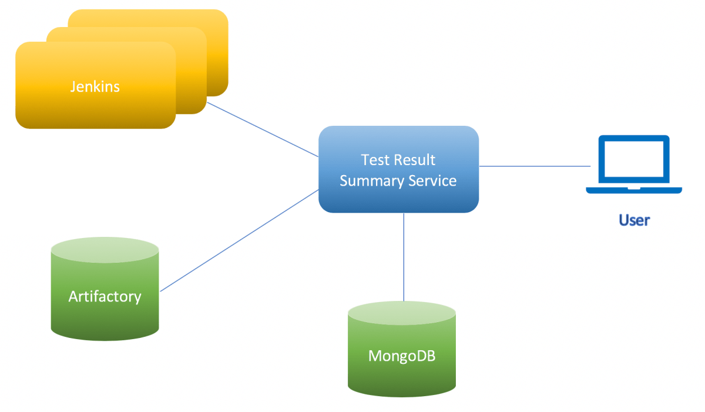 TRSS Overview

If special data is needed for display (i.e., new measurement), user can easily add parser code to TRSS server and client so that different type of tests can be parsed and displayed.

In the multi-server, multi-project scenario, TRSS is a lightweight and customizable open-source solution to monitor, display, compare and triage test results and store history test data. The tool itself is project-agnostic and can be generally applied to any Jenkins-based builds or projects.

We are still in the early development stage.  TRSS is the stepping stone for us to create/integrate with other microservices. For future enhancement, we may tie into Watson Analytics and try out cognitive triage experiments. If you are interested in helping build and improve this project, please engage us in the [AdoptOpenJDK #testing Slack channel](https://adoptopenjdk.slack.com/messages/C5219G28G).
