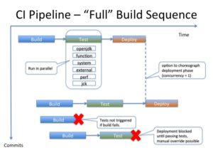
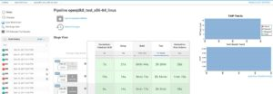

Wow! Hard to believe how much progress has been made since I first posted a mission statement of sorts... (in Part 1: [Testing Java: Let Me Count the Ways](https://blog.adoptopenjdk.net/2017/08/testing-java-let-count-ways)).  As I look back over 2017, and assess where we are at with testing the OpenJDK binaries being produced at [adoptopenjdk.net](https://adoptopenjdk.net/), I am prompted to write this "Part 2" blog post.  The intent is to share the status and some of the accomplishments of the talented and dedicated group of individuals that are contributing their time, skills and effort towards the goal of fully open-source, tested and compliant binaries.

We have added 4 test categories to date (which constitute tens of thousands of tests, running on several platforms, with more to come as machines become available):

* OpenJDK regression tests ("make **openjdk**") - from OpenJDK
* system (and stress) tests ("make **system**") - from AdoptOpenJDK/openjdk-systemtest
* 3rd party application tests ("make **external**") - the unit tests from each application's github repo, such as Scala, Derby, Cassandra, etc.
* compliance (JCK) tests ("make **jck**") - under OCTLA License (**O**penJDK **C**ommunity **T**CK **L**icense **A**greement)

With 2 more test categories on the way:

* functional tests ("make **functional**") - from Eclipse/openj9
* performance benchmarks ("make **perf**") - from various open-source github repos

To make it easy to run these tests, we've added an intentionally thin wrapper that allows us to call some logical make targets to execute these tests.  So the ways that we can tag and categorize the test material include by:
 	
* Test group (as listed above, openjdk, system, external, jck, functional, perf)
* Java version (we currently test Java8, Java9 and Java10 builds)
* VM implementation (we currently test OpenJDK with Hotspot, and OpenJDK with OpenJ9)
* Test level (for example, a quick check for pull request builds, we can tag a subset of tests from any group with "sanity", to run the entire sanity set, "make **sanity**", to run just the subset of openjdk or system tests that have been tagged then "make **sanity.openjdk**" and "make **sanity.system**" respectively)

For more details on this, please check out the presentation [Test Categorization and Test Pipelines at AdoptOpenJDK.](https://www.youtube.com/watch?v=R3rdLIC089k&t=8s)

There is also an [open discussion on setting the test criteria for marking a build "good"](https://github.com/AdoptOpenJDK/openjdk-tests/issues/186).  With the most stringent bar applied to the release builds, nightly builds will have less testing (with constraints such as machine resources and time as factors), and PR builds as mentioned being a targeted sanity check.

We are still getting some of these test builds up and running.  And this is where the call for assistance comes in...  We would love to have extra hands and eyes on the tests at AdoptOpenJDK.  While there are too many tasks to list in this post, here are some meaty work items to pique your interest:

* Triaging any of the open test issues, we know some are likely due to test or machine configuration irregularities, while others are known OpenJDK issues.  Properly annotating the current set of failures and rerunning/re-including fixed issues are top of the TODO list.
* Enabling more 3rd party application tests (currently Scala, and shortly Derby and Solr/Lucene tests are running, with the opportunity to include many more).
* A large percentage of the JCKs are automated.  There is however a set of these compliance tests that are manual/interactive.  We are looking for some dedicated volunteers to help step through the interactive tests on different platforms.
* We have automated these tests in Jenkins Pipeline builds, and want to continue adding builds for the various platforms that the binaries are built on, extra hands here would also be very helpful

Seeing all this come together has been very rewarding.  It has been wonderful to work with the capable and dedicated folks working on the AdoptOpenJDK project.  There is still a long way to go, but we have a great base to start from, and it seems we can make a big difference by offering a truly open and flexible approach to testing Java.  If you really want to learn more about Java, join us in testing it!
