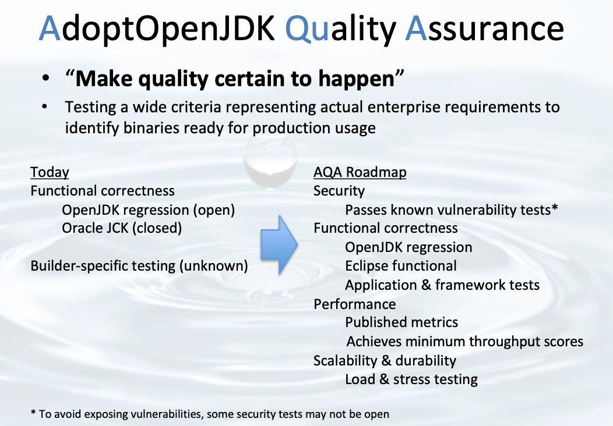
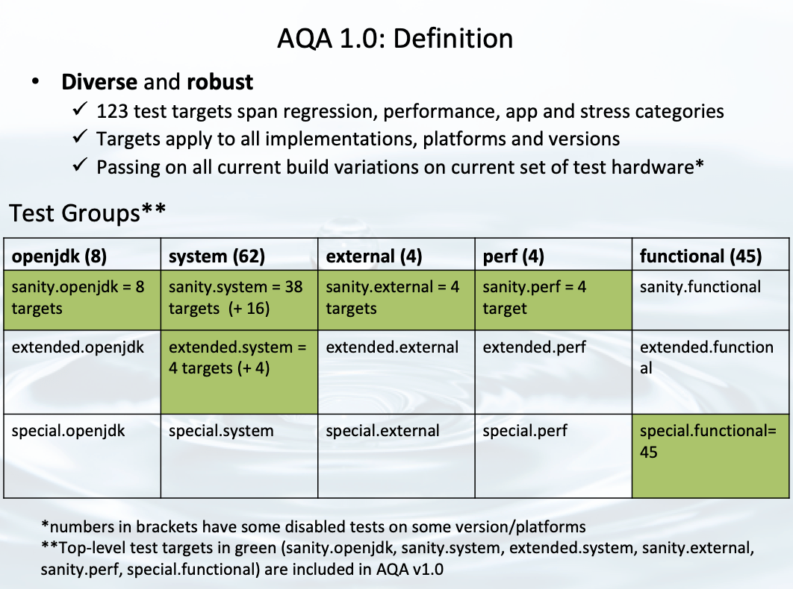
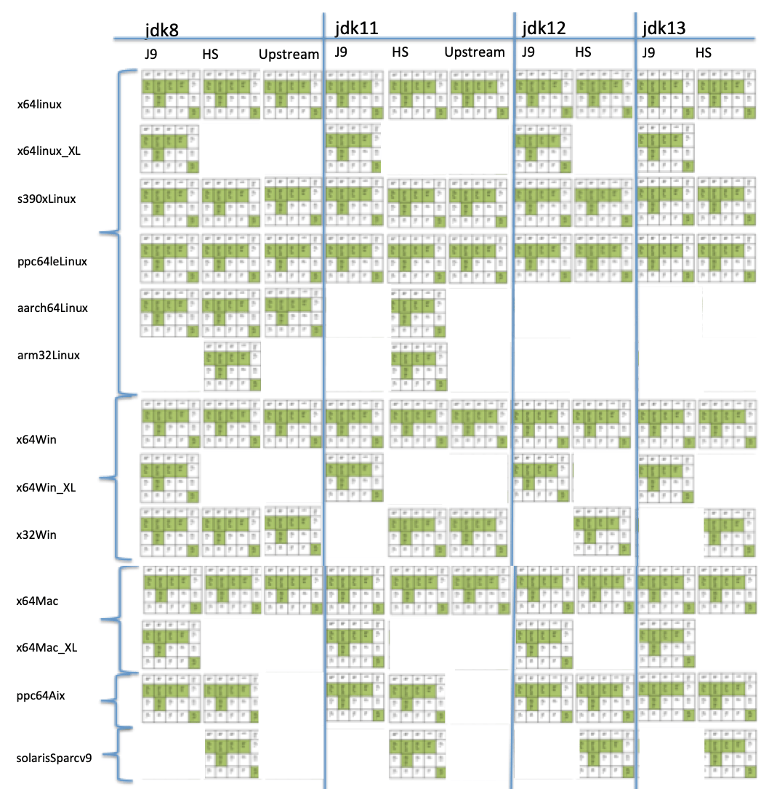

AdoptOpenJDK Quality Assurance (AQA) is a curated set of open tests that we run against our release builds at AdoptOpenJDK.  These tests assess whether a binary meets the high quality standards expected by enterprise customers. They verify that binaries are: 

* Functionally correct
* Secure
* Performant
* Scalable
* Durable

The tests are selected in the spirit of the [AQA manifesto](https://docs.google.com/document/d/16Xsou_sNgSoUI-Sr92Y0QSWO-QtYY09gbTGhtPecCEk/edit?usp=sharing), the set of guidelines that governs our actions when testing OpenJDK releases.  A brief summary of the manifesto is that tests should be:

* **Open** and **transparent**, both in code and the execution
* **Diverse** and **robust** enough to cover the listed enterprise requirements
* **Evolving** alongside implementations which means 
    * continual investment
    * a process to modify the set with oversight by the [AdoptOpenJDK Technical Steering Committee](https://github.com/AdoptOpenJDK/TSC#tsc-members) (TSC), community involvement and quarterly reviews
    * using code coverage data, comparative analysis and other metrics to continuously improve
* **Portable** enough to be run on developers' laptops or on any OpenJDK implementer's CI server
* **Tagged/tracked** and **published** so the exact test material can be found should we wish to rerun tests and reproduce results

AQA is not just a set of tests, but a system that keeps tests fresh and applicable using gathered metrics and input from the community. We want to “**_make quality certain to happen_**”, that is to assure quality for the community by being transparent, open and actively inviting community involvement. 

Should you have feedback or input, please add comments to the [AdoptOpenJDK/openjdk-tests AQA issue](https://github.com/AdoptOpenJDK/openjdk-tests/issues/965)!

*AQA v1.0  is a first drop in an on-going series of improvements.* 

As I _dive_ further into this topic, I will attempt to avoid too many water metaphors _sprinkled_ throughout this introduction to **A**doptOpenJDK **Qu**ality **A**ssurance (AQA) ...or AQuA if you are so inclined.  

> When the Well is Dry, We’ll Know the Worth of Water.
> 
> <cite>Benjamin Franklin</cite>

Why AQA?  We believe that open languages deserve open testing.  When we looked at what testing was openly available to developers and to OpenJDK implementers, and running on visible servers, the 'well' was somewhat 'dry'.   There’s the OpenJDK regression suite, a wonderful set of tests, but does not cover all of the verification requirements needed to **_"make quality certain to happen"_**.  Those regression tests begin to address the functional correctness requirement but we also needed to verify the  security, scalability, performance, durability requirements.  Our roadmap arose from the lack of a large and diverse _pool_ of tests being used to verify the quality of OpenJDK binaries, and the desire to run testing in the open.   

The AQA roadmap sees us expand open test coverage significantly.   Our AQA roadmap sees us expand open test coverage significantly to include tests not only from the OpenJDK project, but from many other open repositories. It includes open performance benchmarks, application suites (including Scala, Derby, Lucene-solr, Jenkins, Wildfly, Kafka, Tomcat, and Elasticsearch), Microprofile TCKs, and a very large set of system and load tests. 

*AQA Roadmap - open & transparent testing for quality assurance*

Tests at AdoptOpenJDK are divided into groups: 

1. **openjdk** - The regression test suite from the OpenJDK project.
2. **system** - System and load tests contributed to the AdoptOpenJDK and Eclipse OpenJ9 projects.
3. **external** - Functional test suites from large Java applications plus Microprofile TCK tests, all run in containerized environments.
4. **perf** - Open-source performance benchmarks (both large-scale from dacapo and renaissance projects, and microbenchmarks contributed to AdoptOpenJDK).
5. **functional** - Functional tests from both the Eclipse OpenJ9 project and those contributed to AdoptOpenJDK.

Each group is split into 3 levels: 

1. **sanity** - Tests tagged as more critical to run frequently, testing against more commonly used packages or modules, or those areas that are under active development. These tests are run in nightly builds and release builds.
2. **extended** - Tests in this set are run less frequently (weekly), often targeting less used or less changed code.
3. **special** - Tests that need special hardware or configuration and/or can take an especially long time to run are in this test level. These tests are often excluded when run on a developer laptop or on limited hardware.

For version 1.0 of AQA, we selected tests that ensure our build and test mechanisms are working as we expect. Each of the 123 test targets in v1.0 contains many test cases. A few notes about the set:

* **sanity.openjdk** = 8 targets, ~3300 test cases
* **sanity.system** & **extended.system** = 62 targets, ~25,000 tests.  These system tests are repeated over manyiterations to put the binaries under load, over 30 million times to properly stress them.
* **sanity.external** = 4 targets, ~2500 test cases which are microprofile TCKs of various flavours (Openliberty,Thorntail, Payara, and Tomee) 
* **special.functional** = 45 targets that focus on Multi-Byte Character Set tests 
* **sanity.perf** = 4 performance benchmarks (for v1.0, these targets are run and treated as functional tests, ensuringthat they run without issue)

Additional details about the test targets can be found at the [Graduated Testing & Test Numbers wiki](https://github.com/AdoptOpenJDK/openjdk-tests/wiki/Graduated-Testing-&-Test-Numbers) page.

*Grid of Test Targets by logical groups & levels*

Multiplying the versions, platforms and implementations expands the grid into a much larger test matrix.  The implementations refer to different builds (J9=[OpenJ9](https://api.adoptopenjdk.net/v2/info/nightly/openjdk8?openjdk_impl=openj9), HS=[Hotspot](https://api.adoptopenjdk.net/v2/info/nightly/openjdk8?openjdk_impl=hotspot) and [Upstream](https://adoptopenjdk.net/upstream.html) respectively) which are available from [adoptopenjdk.net](https://adoptopenjdk.net/).

*AQA v1.0 Test matrix, platforms x versions x implementations (OpenJ9, Hotspot, Upstream)*

In upcoming versions of AQA, we will broaden the test coverage and increase the number of tests that must pass and set some baselines for the perf test targets in order for binaries to receive the AQA stamp of approval. 

Our goal and intention is for AQA to provide the community with a valuable quality assurance toolkit and set a high bar for OpenJDK binaries being produced and distributed. We believe that working together on this toolkit in an open and collaborative environment will be beneficial to all implementers, developers, consumers, and stakeholders within the open community.

*[Lotus effect](https://en.wikipedia.org/wiki/Lotus_effect) on nasturtium, self-cleaning property reminiscent of AQA on OpenJDK binaries*

You can check out this [lightning talk on AQA](https://youtu.be/gSsyO_EIPbY?t=54) or drop us a note in the AdoptOpenJDK Slack channel devoted to [#testing](https://adoptopenjdk.slack.com/messages/C5219G28G) topics, or _dip_ into some of our [test documentation](https://github.com/AdoptOpenJDK/openjdk-tests#adoptopenjdk-testing) to get involved.

