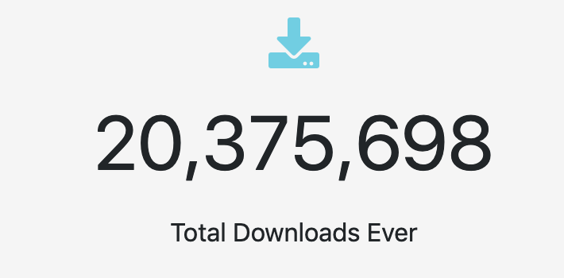

## 20 Million Downloads

First and foremost AdoptOpenJDK has officially hit 20 million downloads! Steve Wallin was the first to tweet about it here:

<blockquote class="twitter-tweet">
Congratulations to <a href="https://twitter.com/adoptopenjdk?ref_src=twsrc%5Etfw">@adoptopenjdk</a> for hitting 20 million downloads!
&mdash; Steve Wallin (@stevewallin) <a href="https://twitter.com/stevewallin/status/1115009964907610112?ref_src=twsrc%5Etfw">April 7, 2019</a></blockquote> 

With the recent launch of the AdoptOpenJDK [Download Dashboard](https://dash.adoptopenjdk.net/), it has become easier than ever to track the downloads for each release. It was only on the 14th March that the project hit the 15 million downloads milestone so to get another 5 million downloads in under a month is a true testament to the rapid growth of the project.

*[https://dash.adoptopenjdk.net](https://dash.adoptopenjdk.net/) — 8th April 2019*

## OpenJDK 12

Yes, that’s right! The first public OpenJDK™ 12 release came out on the 19th March…

AdoptOpenJDK got their first releases out just **24 hours** after the upstream project which is an incredible achievement so a massive thank you to all who were involved!

For HotSpot releases click [here](https://adoptopenjdk.net/releases.html?variant=openjdk12&jvmVariant=hotspot).

For OpenJ9 releases click [here](https://adoptopenjdk.net/releases.html?variant=openjdk12&jvmVariant=openj9).

## 5000 followers

Another big milestone was reached here! The official [twitter](https://twitter.com/adoptopenjdk) account reached 5000 followers on the 28th of March. If you haven’t already make sure you give the account a follow to always get the latest updates from the project.

<blockquote class="twitter-tweet">
We are just 1 follower shy of 5000 followers! Who&#39;s the lucky person going to be? Thank you everyone for the continued support! <a href="https://twitter.com/hashtag/Thanks?src=hash&amp;ref_src=twsrc%5Etfw">#Thanks</a> <a href="https://twitter.com/verified?ref_src=twsrc%5Etfw">@verified</a>
&mdash; AdoptOpenJDK (@adoptopenjdk) <a href="https://twitter.com/adoptopenjdk/status/1111273234106929157?ref_src=twsrc%5Etfw">March 28, 2019</a></blockquote> 

## Installers

Lots of work has been taking place behind the scenes at the installer workgroup. For those who haven’t already noticed, both Windows (.msi) and macOS (.pkg) installers have been produced as part of the nightly pipelines for a couple of weeks now. For those wanting Linux installers (.deb and .rpm) you’ll be pleased to know that they too are well underway [here](https://github.com/AdoptOpenJDK/openjdk-installer/pull/79). The OpenJDK 12 release was the first release to go out with installers for both Windows and macOS but OpenJDK 8 and 11 are also soon to be released. The .pkg installers are now also getting rolled out by default in the [homebrew casks](https://github.com/AdoptOpenJDK/homebrew-openjdk) rather than using the tarballs.

## AdoptOpenJDK System Status

For those looking for status updates on AdoptOpenJDK you can now head over to the brand new status page where any critical service announcements will be posted: https://status.adoptopenjdk.net/

## Commercial Support

The [support](https://adoptopenjdk.net/support.html) page at AdoptOpenJDK was updated. It now includes the commercial support offerings by both [IBM](https://www.ibm.com/cloud/support-for-runtimes) and [jClarity](https://www.jclarity.com/adoptopenjdk-support/).

## Icedtea-Web

The AdoptOpenJDK project was very excited to welcome the Icedtea-web repo to the project which was kindly donated by the folks at RedHat. The move happened in March and there has been lots of activity in the new repo which can be found [here](https://github.com/AdoptOpenJDK/icedtea-web).

## Testimonials Page

AdoptOpenJDK is creating a testimonials page for the website. The idea here is that we can use it as a platform to show off all the companies that have already started AdoptOpenJDK binaries in production. If you’d like to have your own company logo included in this then fill in the Google Form in the tweet below:

<blockquote class="twitter-tweet">
If your company is using AdoptOpenJDK binaries then make sure to fill in our form <a href="https://t.co/xxK6XqJXN3">https://t.co/xxK6XqJXN3</a> to get your logo included on our new &quot;Users&quot; page. <a href="https://twitter.com/hashtag/helpwanted?src=hash&amp;ref_src=twsrc%5Etfw">#helpwanted</a> <a href="https://twitter.com/hashtag/adoptopenjdk?src=hash&amp;ref_src=twsrc%5Etfw">#adoptopenjdk</a> <a href="https://twitter.com/hashtag/OpenJDK?src=hash&amp;ref_src=twsrc%5Etfw">#OpenJDK</a>
&mdash; AdoptOpenJDK (@adoptopenjdk) <a href="https://twitter.com/adoptopenjdk/status/1112607373103951872?ref_src=twsrc%5Etfw">April 1, 2019</a></blockquote> 
